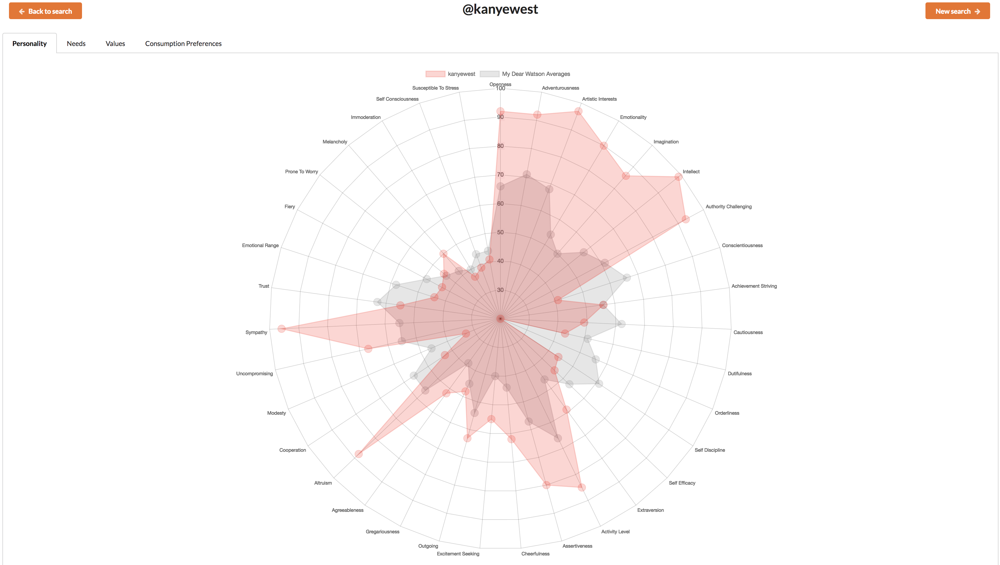
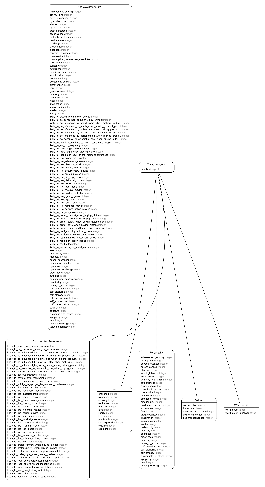

# My Dear Watson

[Live (not yet)](https://google.com)

IBM Watson personality insights from Twitter posts rendered through Chart.js data visualization. Ruby on Rails backend and React frontend.

* [My Dear Watson Backend](https://github.com/matjack9/my-dear-watson/tree/master/my-dear-watson-backend)
* [My Dear Watson Frontend](https://github.com/matjack9/my-dear-watson/tree/master/my-dear-watson-frontend)

## Demo

## How To Use

* Enter a Twitter handle to analyze
* Review IBM Watson's scoring of Personality, Needs, Values, and Consumption Preferences for the user
* Compare the results to the averages of previously searched unique twitter handles
* As the database of Twitter handles grow, the averages refine

## Tech

* Ruby v5.1.4
* Ruby on Rails v5.1.5
* PostgreSQL 10
* React v16.3.1
* Notable Gems:
  * watson-api-client: handling IBM Watson API calls
  * twitter: handling Twitter API calls
  * figaro: storing API keys
  * (testing frameworks)
* Notable JavaScript Libraries:
  * axios => handling promises
  * react-chartjs-2 => charting analyses
  * uuid => creating unique react keys
  * semantic-ui-react => styling
  * prop-types => confirming react prop types in development
  * jest => unit testing

## Database Relationships

## Prerequisites

* Ruby v5.1.4
* PostgreSQL 10
* React v16.3.1

## Installation

1.  Fork and clone [this repo](https://github.com/matjack9/my-dear-watson)
2.  Navigate to `/my-dear-watson-backend`, and complete Backend Setup
3.  In a separate terminal window, navigate to `/my-dear-watson-frontend`, and complete Frontend Setup

### Backend Setup

After navigating to `/my-dear-watson-backend`:

1.  Install Gems `bundle install`
2.  Request API keys from [IBM Watson](https://console.bluemix.net/registration/?target=%2Fdeveloper%2Fwatson%2Fcreate-project%3Fservices%3Dpersonality_insights%26hideTours%3Dtrue&cm_mmc%3DOSocial_Tumblr-_-Watson%2BCore_Watson%2BCore%2B-%2BPlatform-_-WW_WW-_-wdc-ref%26cm_mmc%3DOSocial_Tumblr-_-Watson%2BCore_Watson%2BCore%2B-%2BPlatform-_-WW_WW-_-wdc-ref%26cm_mmca1%3D000000OF%26cm_mmca2%3D10000409)
3.  Request API keys from [Twitter](https://developer.twitter.com/)
4.  Store the relevant keys in:

* `/app/controllers/api/v1/watson_api_controller.rb`
* `/app/controllers/api/v1/twitter_api_controller.rb`

5.  Setup Database `rake db:create` then `rake db:migrate`
6.  Seed database `rake db:seed`
7.  Start your server `rails s`

### Frontend Setup

After navigating to `/my-dear-watson-frontend`:

1.  Install dependencies `yarn install`
2.  Start your server `yarn start`

### In Your Browser

Navigate to the web address of your Node server, e.g. [http://localhost:3001](http://localhost:3001)

## Tests

TBD

## Future Improvements

* Move away from alert error messages
* Twitter handles saved in the database in same casing as on Twitter
* Implement Twitter profile photos
* Have charts always scale from 0-100
* Ability to compare analyses between two users and not only between a user and averages

## Credits

* [IBM Watson Personality Insights](https://www.ibm.com/watson/services/personality-insights/)
* [Twitter](https://twitter.com/)

© [Matt Jackson](https://www.linkedin.com/in/matjack/)
